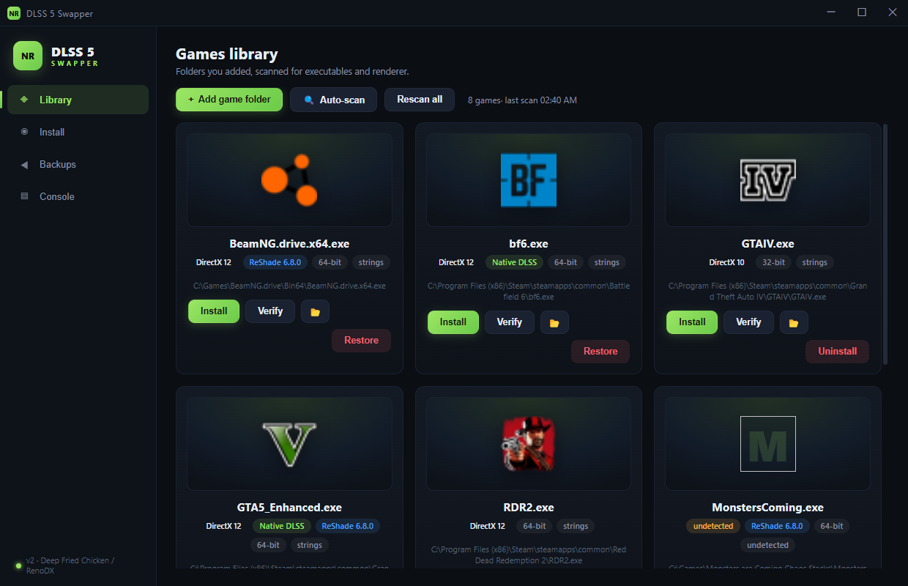
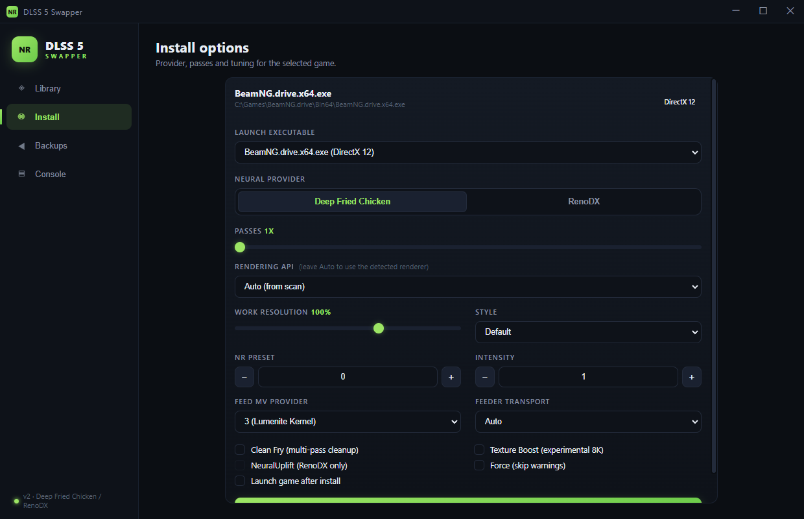

# DLSS 5 Swapper

Self-contained PowerShell installer for the **DLSS 5 Neural Rendering stack** into
games that do not ship a native DLSS implementation. Comes with an optional
Electron desktop UI. Built as a Windows-only reimplementation of the concepts in
[rakanki911/DLSS5-Swapper](https://github.com/rakanki911/DLSS5-Swapper).


> **⚠️ WARNING - DO NOT USE IN MULTIPLAYER / ONLINE GAMES**
>
> This tool injects DLLs and shader layers into the game process. In any
> multiplayer, online, ranked, or anti-cheat-protected game (BattlEye, EAC,
> Vanguard, Ricochet, and the like) this is considered cheating and **can get
> your account banned** - sometimes permanently, hardware bans included. Use it
> **only** in offline / single-player titles and modes. You are responsible for
> what you inject into.

## Quick start

### 1. Get the code

```powershell
git clone https://github.com/IsGaraa/DLSS5.git
cd DLSS5
git lfs pull        # the binary kit ships via Git LFS
```

> Updating: `git pull` (or launch the UI - it checks for updates and restarts
> itself when a newer version exists).

### 2. Requirements

| Requirement | Why | Verdict |
|---|---|---|
| Windows 10+ x64 | 64-bit hooks and neural runtimes | required |
| PowerShell 5.1+ | the backend is a single `.ps1` | required |
| Node.js 18+ | the Electron UI | only for the UI |
| Git + Git LFS | cloning and updating the repo, pulling `kit/` | required |
| The `kit/` folder | binary DLLs and addons (already in the repo) | ships with clone |

### 3. Launch the UI

From the repo root, double-click:

```
DLSS5-UI\start.bat
```

or run it from the `DLSS5-UI` folder:

```
npm start
```

The Electron window opens directly (no console window stays open). From there:

| Action | How |
|---|---|
| **Add games** | *Add game folder* (scans just that folder) or *Auto-scan* (launchers or deep-scan a drive) |
| **Rescan** | *Rescan all* re-scans every saved folder; the last scan is cached and loads instantly at startup |
| **Install** | Pick a game, choose a provider and options, click *Install* |
| **Verify** | Check what ended up in the folder vs. the manifest |
| **Restore** | Roll back any install from the journaled backup |

### 4. Or use the CLI - no UI needed

Everything the UI does works straight from PowerShell:

```powershell
# scan a game folder
.\DLSS5-Swapper.ps1 -Scan -GamePath "C:\Games\SomeGame"

# install (API auto-detected, Deep Fried Chicken by default)
.\DLSS5-Swapper.ps1 -Install -GamePath "C:\Games\SomeGame"

# 3 neural passes, Lumenite Kernel motion vectors
.\DLSS5-Swapper.ps1 -Install -GamePath "C:\Games\SomeGame" -Passes 3

# RenoDX with NeuralUplift
.\DLSS5-Swapper.ps1 -Install -GamePath "C:\Games\SomeGame" -Provider renodx -NeuralUplift

# verify
.\DLSS5-Swapper.ps1 -Verify -GamePath "C:\Games\SomeGame"

# uninstall / restore the originals
.\DLSS5-Swapper.ps1 -Uninstall -GamePath "C:\Games\SomeGame"

# auto-discover games from installed launchers
.\DLSS5-Swapper.ps1 -Discover -Json

# deep-scan C: (depth 6, capped at 600 game folders)
.\DLSS5-Swapper.ps1 -Discover -Root "C:\" -Depth 6 -Json
```

Add `-DryRun` to any install to preview changes without touching the disk, and
`-Launch` to start the game right after installing.

## Screenshots





## Features

- **Render API auto-detection** - PE import / delay-load / binary-string analysis
  for every `.exe` in a game folder - DirectX 8/9/10/11/12, Vulkan, OpenGL -
  no per-game database needed.
- **DLSS 5 transport** - the `DLSS5-Feeder` loadable addon plus the NVIDIA
  Neural Rendering runtimes (`nvngx_dlss.dll`, `nvngx_dlssnr.dll`). Games with
  native DLSS skip the feeder and plug straight into the native stream.
- **Neural providers** (selectable):
  - `chicken` (default) - **Deep Fried Chicken**, 1-30 sequential neural passes.
  - `renodx` - **RenoDX DLSS5 Generic**, a single NeuralUplift pass.
- **ReShade integration** - dxgi proxy for DirectX 11/12 (32-bit and 64-bit),
  global / per-user Vulkan layer, `DLSS5_Feed.fx` + `lumenite_Kernel.fx`
  motion-vector pipeline, `ReShade.ini` / `ReShadePreset.ini` wiring. Installs
  ship the **complete** ReShade shader package - all LumeniteFX/vort effects
  plus `include/`, `Includes/` and `DrawText.fxh` - so every motion-vector
  provider compiles (the kit once shipped only the feeder effect, which left
  the default Lumenite Kernel provider uncompileable and the output dead).
- **32-bit game support** - 32-bit titles get DLSS 5 through a 64-bit **host
  helper** (`host64\dlss5-feed-host64.exe` + its own ReShade) installed beside
  the game, with the 32-bit feeder add-on (`dlss5-feed.addon32`) hooked into
  the game's ReShade; the helper and game share memory across the bitness
  boundary. **DirectX 8/9** 32-bit titles are D3D-translated with **dgVoodoo2**
  (built locally - see Notes *dgVoodoo2* below).
- **Journaled installs** - every original file is backed up to
  `_DLSS5_Backup\` with a manifest, and `-Uninstall` restores everything.
- **Auto game discovery** - scan installed launchers (Steam, GOG, Epic, EA,
  Origin, Ubisoft) or deep-scan any drive/folder; results are saved so a
  rescan catches newly installed games.
- **Main-executable filtering** - the scan flags the main game executable
  (DX12 preferred, then shallowest folder, then largest file) so the library
  shows one clean card per game instead of every launcher/stub/helper exe;
  alternate executables stay available via the launch picker on the install
  page.
- **Instant library** - the last scan is cached, so the UI opens directly on
  your library without re-scanning every folder at startup; hit *Rescan* to
  refresh. With no cached library and no folders yet, the UI auto-detects
  games from your installed launchers automatically.
- **Executable icons** - real icons are extracted from each game's `.exe` and
  shown on the cover-style library cards.
- **Startup auto-update** - the UI checks the GitHub remote on launch and
  fast-forwards + restarts itself when a newer version is available.

## Automation (`-Json`)

Every command accepts `-Json`: all human-readable output goes to stderr, and a
single compact JSON document is emitted on stdout - designed for the Electron
UI and for scripting:

```powershell
.\DLSS5-Swapper.ps1 -Scan    -GamePath "C:\Games\SomeGame" -Json
.\DLSS5-Swapper.ps1 -Install -GamePath "C:\Games\SomeGame" -Provider renodx -Json
.\DLSS5-Swapper.ps1 -Discover -Json
```

### JSON shapes

| Command | Response fields |
|---|---|
| `-Scan` | `gameDir`, `chosen`, `candidates[]` (each with a `Main` flag), `hasNativeDlss`, `reshade{}` |
| `-Install` | `exe`, `api`, `provider`, `passes`, `feeder`, `added[]`, `dryRun`, `manifestPath` |
| `-Verify` | `exe`, `api`, `checks[]`, `provider`, `installed` |
| `-Uninstall` | `removed[]`, `restored[]` |
| `-Discover` | `launchers`, `root`, `folders[]`, `scans[]` (each scan is a `-Scan` shape) |

## Install options

| Option | Values | Default | Meaning |
|---|---|---|---|
| `-Provider` | `chicken` / `renodx` | `chicken` | Neural provider |
| `-Passes` | 1-30 | 1 | Chicken pass count |
| `-Api` | auto/d3d8/d3d9/d3d11/d3d12/vulkan/opengl | auto | Force the render API |
| `-Feeder` | auto/forced/off | auto | DLSS5-Feeder mode |
| `-WorkResolution` | 10-150 | 100 | Neural work resolution % |
| `-Style` | default/natural/cinematic | default | Chicken NR style |
| `-Preset` | 0+ | 0 | NR preset index |
| `-Intensity` | 1-4 | 1 | NR intensity |
| `-MVProvider` | 0-4 | 3 | Feed MV provider (3 = Lumenite Kernel) |
| `-CleanFry` | switch | off | Chicken multi-pass cleanup |
| `-TextureBoost` | switch | off | Experimental 8K path |
| `-NeuralUplift` | switch | off | RenoDX NeuralUplift |
| `-KitPath` | path | `.\kit` | Override the file kit location |
| `-Exe` | name.exe | auto | Pick a specific executable |
| `-DryRun` | switch | off | Do not write anything |
| `-Force` | switch | off | Proceed despite warnings |
| `-Launch` | switch | off | Start the game after install |

### Discovery options

| Option | Values | Default | Meaning |
|---|---|---|---|
| `-Discover` | switch | - | Auto-discover games |
| `-ScanRoot` | path | (launchers) | Root folder for deep scan |
| `-Depth` | 1-8 | 6 | Max sub-folder depth for deep scan |

## How API detection works

The scan walks the game folder (up to three levels deep) and for each `.exe`
reads the PE headers directly:

1. **Imports** - the standard import directory (index 1) and the delay-load
   directory (index 13) are parsed; the first "important" DLL wins:
   `d3d12.dll` -> D3D12, `d3d11.dll` -> D3D11, `d3d10*.dll` -> D3D10,
   `dxgi.dll` -> DXGI, `vulkan-1.dll` -> Vulkan, `d3d9.dll` -> D3D9,
   `d3d8.dll` -> D3D8, `opengl32.dll` -> OpenGL.
2. **Strings** - if the imports are obfuscated (packers), binary markers such as
   `D3D12CreateDevice`, `D3D11CreateDevice`, `vkCreateInstance`, etc. are
   searched in the raw file bytes.
3. **Wrappers** - if the game links D3D but ships a DXVK/vkd3d wrapper DLL next
   to the exe, the render API is reported as **Vulkan**.
4. **Fallbacks** - sibling-module imports and file-name heuristics.

Both D3D11 and D3D12 map to the `dxgi.dll` payload hook in ReShade.

## Provider comparison

| | Deep Fried Chicken | RenoDX DLSS5 Generic |
|---|---|---|
| Passes | 1-30 sequential | 1 |
| NeuralUplift | (highest pass) | Supported |
| Frame generation coexistence | Experimental | - |
| Feeder `warmup_rebuild` | `0` (required) | `180` |
| Coexists in folder | Conflicts ignored (Chicken wins) | same |

Chicken's multi-pass is the real "DLSS 5" selling point: every layer runs its
own full neural pass, so quality scales with `-Passes`.

## Notes & limitations

- **64-bit + 32-bit (host helper)** - the neural stack (`nvngx_dlss*`, both
  providers and the feeder add-ons) is x86-64, so a 32-bit game cannot load it
  directly. For **32-bit games** the installer puts a 64-bit **host helper**
  (`host64\`) next to the game - `dlss5-feed-host64.exe`, its own ReShade hook
  and the NVIDIA runtimes - while the game folder gets the 32-bit feeder
  (`dlss5-feed.addon32`). The helper does the NGX work over shared memory, so a
32-bit game gets DLSS 5 the same way the community does on GTA San Andreas
   and the like. A bundled 32-bit ReShade hook (`dxgi.dll`) is deployed next to
   the exe automatically, and **DirectX 8/9** games are wrapped automatically
   with **dgVoodoo2** (D3D8/9 -> D3D11). The UI asks for confirmation before
   installing into a 32-bit game.
- **dgVoodoo2** - DirectX 8/9 translation for 32-bit games is **not bundled
  with the repo**: antivirus products flag dgVoodoo's DLLs on download (known
  false positives, 29/66 on VirusTotal), so nothing in this repository ever
  triggers that on a fresh clone. Instead the installer builds it from a local
  folder: grab the official release
  (<https://github.com/dege-diosg/dgVoodoo2/releases> - a 32-bit `D3D8.dll` /
  `D3D9.dll`, `dgVoodoo.conf` and `dgVoodooCpl.exe` from the zip), set
  `"dgvoodoo": "C:\\path\\to\\extracted"` in `sources.json`, run `-BuildKit`,
  and the 32-bit D3D8/9 path auto-deploys those files next to the game's exe.
  Without them the installer warns and copies only with `-Force`.
- **DirectX 8/9 (64-bit)** need a manual dgVoodoo2 setup (D3D9 -> D3D11
  translation) before the stack can hook them; the script warns but copies
  with `-Force`.
- **OpenGL** needs a ReShade `opengl32.dll` proxy that is not bundled.
- **Vulkan** picks the machine-wide ReShade layer
  (`C:\ProgramData\ReShade\`); if absent it falls back to a per-user implicit
  layer under `%USERPROFILE%\.dlss5vulkanlayer`.
- **Shader package** - `-BuildKit` harvests the whole ReShade shader tree from
  the local rpcs3 source (`reshade-shaders\Shaders`: `lumenite_*.fx`,
  `vort_*.fx`, `include/` and `Includes/`), and takes `DrawText.fxh` from the
  optional `"shadercore"` entry in `sources.json`. The full tree is what the
  installer deploys to `reshade-shaders\Shaders` next to the game's exe - the
  Lumenite Kernel motion-vector provider (`-MVProvider 3`, the preset default)
  includes `include/*.fxh` and `DrawText.fxh` at compile time, so without the
  complete package it fails to compile and the feed reports zero motion
  vectors.
- Games with **anti-cheat** (BattlEye etc.) may reject injected modules; use
  the offline/Story modes where available.

### 32-bit / host-helper path: known issues (future fix)

The 32-bit host-helper path is **experimental** and only partially working.
Verified on GTA IV; treat it as a known-broken area marked for a **future fix**:

- **DLSS 5 often "does nothing" visually.** ReShade loads, the feeder runs and
  the host renders DLAA frames, but the output looks unchanged. On GTA IV the
  measured cause was the neural consumer: `renodx-dlss5` v4.7 (RenoDX provider)
  faulted inside the neural evaluate (access violation in `D3D12Core.dll` via
  `nvngx_dlssnr.dll`) with current NVIDIA drivers. **Deep Fried Chicken** (the
  default `chicken` provider) works with the same driver - use `-Provider chicken`
  for 32-bit host games. Driver 616.56 also passes with either provider.
- **No RenoDX.DLSS5 tab in the game's overlay.** For a 32-bit game the provider
  add-on runs in the hidden `host64\dlss5-feed-host64.exe` helper process, not in
  the game - so the game's ReShade overlay only lists the feed add-on under
  *Addons*, and the RenoDX/Chicken panel you expect never appears there. Tuning
  is done by editing `host64\deep-fried-chicken.cfg` next to the exe.
- **Host window / focus chaos.** The helper spawns behind the game, and some
  titles (GTA IV: fullscreen -> windowed -> taskbar -> stuck at the menu) fight
  the hidden host window for focus once the game starts. Launch through the
  game's launcher/Steam; launching the raw exe may also crash the game even
  without any of this installed.
- Until these are fixed, prefer 64-bit titles - the 64-bit path (in-game hook,
  visible RenoDX/Chicken tab, no host helper) is the reliable one.

## Repository layout

```
DLSS5-Swapper.ps1    # backend - the whole tool (single file)
DLSS5-UI/            # Electron desktop app
  main.js            #   main process (IPC, swapper bridge, icon cache)
  preload.js         #   context bridge (ipcRenderer -> window.dlss5)
  icons-extract.ps1  #   batch .exe icon extraction -> www/icons (PNG)
  www/
    index.html       #   shell (titlebar + sidebar + pages)
    style.css        #   full dark theme
    app.js           #   renderer logic (library, install, verify, backups, console)
  package.json       #   electron dependency + start script
  start.bat          #   one-click launcher (no console window)
  library.json       #   saved game folders (gitignored)
  library-cache.json #   last scan, loads instantly at startup (gitignored)
kit/                 # harvested binary kit (built by -BuildKit, tracked via Git LFS;
                     #   local-only extras like dgvoodoo/ are gitignored - see Notes)
```

## Credits

- [DLSS5-Feeder](https://github.com/zeroeightysix/DLSS5-Feeder) - the DLSS5
  transport addon
- [Deep Fried Chicken](https://www.nexusmods.com/site/mods/1692) - multi-pass
  neural provider
- [RenoDX](https://www.nexusmods.com/site/mods/943) - DLSS5 Generic addon
- [DLSS 5 Swapper](https://github.com/rakanki911/DLSS5-Swapper) - original app
  concept this script reimplements